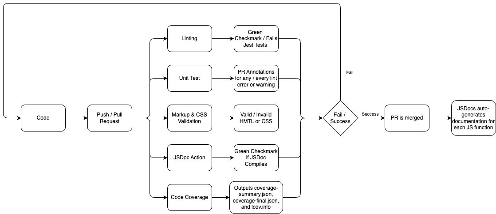

# CI/CD Pipeline Overview



#### Overview: In phase 1, we made a cookie-cutter CI/CD pipeline that runs unit tests, lint checks, and HTML validation. We also enforced peer review before merging to main. In phase 2, we added onto it by adding a code coverage check and automatic documentation generation using JSDoc. We plan to add E2E testing and code quality checks.

## 1. What’s Working Today 

| Stage | Job ID | Purpose | Triggers | Outcome when **passing** |
|-------|--------|---------|----------|--------------------------|
| **Unit Tests** | `tests` | Runs Jest against `./__tests__/dummy-test.js` (and any other tests we add). | `push`, `pull_request` | Green check‑mark; fails workflow for failed Jest tests. |
| **Linting** | `lint` | Executes `npx eslint ./` after installing dependencies. | `push`, `pull_request` | Annotations on PRs for every lint error or warning + fails the workflow on errors. |
| **Markup & CSS Validation** | `validate-html` | Uses **Nu HTML Checker** (via `Cyb3r‑Jak3/html5validator-action@v7.2.0`) to scan all `*.html` (and `.r.html`) files. | `push`, `pull_request` | Fails the workflow on invalid HTML/CSS. |
| **Require merge / code‑owner reviewers** | `review` | Enforce peer review before merging to `main`. | `pull_request` | Doesn't allow merge until approval |
| **Code Coverage** | `coverage` | Has the Github Actions bot automatically report code coverage on each PR as a comment | `pull_request` | Gives extra information for reviewers to look at before approving or requesting changes |
| **JSDoc Generation** | `jsdoc` | Automatically generates a page for documentation of js functions and deploys it to github pages | `push` to `main` | The Github Actions bot automatically creates generates styled html code for every function that has documentation, and then creates a PR to deploy this code to main |

---

## 2. Planned Next 

| Idea | Target Release | Rationale |
|------|----------------|-----------|
| E2E Testing | Before final submission | It's really helpful to have and a great way to quickly check that we haven't broken anything |
| Code quality checks | Before final submission | It could be helpful to see how each PR impacts code quality, giving the reviewer more insight before approving it |

---

## 3. YAML at-a-glance

```yml
name: CI 

on:
  push:
    branches:
      - main # only run on direct pushes to main
  pull_request:
    # run on all PRs

jobs: 
  tests:
    runs-on: ubuntu-latest
    steps:
      - uses: actions/checkout@v4
      - name: Install Dependencies
        run: npm install
      - name: Unit Test
        run: npm run test
    
  lint:
    runs-on: ubuntu-latest
    steps:
    - uses: actions/checkout@v4
    - name: Install modules
      run: npm install
    - name: Run ESLint
      run: npx eslint ./ --ignore-pattern docs/

  validate-html:
    runs-on: ubuntu-latest
    steps:
      - uses: actions/checkout@v4

      - name: Validate markup with Nu HTML Checker
        uses: Cyb3r-Jak3/html5validator-action@v7.2.0   
        with:
          root: .               
          format: gnu        
          css: true  
          blacklist: docs 

  jsdoc:
    runs-on: ubuntu-latest
    permissions:
      contents: write
    steps:
      - name: Checkout branch
        uses: actions/checkout@v4

      - name: Install modules
        run: npm install

      - name: Run JSDoc
        run: npx jsdoc ./js -r -d ./docs/jsdoc
```

```yml
name: Code Coverage

# grant Actions permission to write PR comments
permissions:
  contents: read
  pull-requests: write

on:
  pull_request:
    branches: [main]
  push:
    branches: [main]

jobs:
  test-and-report:
    runs-on: ubuntu-latest
    steps:
      - name: ⬇️ Checkout code
        uses: actions/checkout@v3

      - name: 🟢 Setup Node.js
        uses: actions/setup-node@v3
        with:
          node-version: 18

      - name: 📦 Install dependencies
        run: npm install

      - name: ✅ Run tests with coverage
        run: npm test

      - name: 📊 Generate Coverage Report
        uses: davelosert/vitest-coverage-report-action@v2
        with:
          github-token: ${{ secrets.GITHUB_TOKEN }}
          vite-config-path: ''                       # prevents the Vite config warning
          json-summary-path: docs/coverage/coverage-summary.json
          json-final-path:   docs/coverage/coverage-final.json
          comment-on:       pr

```

```yml
name: JSDoc Generation

on:
  push:
    branches:
      - main

jobs:  
  jsdoc:
    if: "!contains(github.event.head_commit.author.name, 'github-actions')"
    runs-on: ubuntu-latest
    permissions:
      contents: write
      pull-requests: write
    steps:
      - name: Checkout branch
        uses: actions/checkout@v4
        with:
          fetch-depth: 0
          ref: main

      - name: Install modules
        run: npm install

      - name: Run JSDoc
        run: npx jsdoc ./js -r -d ./docs/jsdoc

      - name: Commit and push docs
        run: |
          git config user.name "github-actions[bot]"
          git config user.email "github-actions[bot]@users.noreply.github.com"

          git checkout -B jsdoc/generate-docs

          git add docs/jsdoc
          git commit -m "Update JSDoc documentation" || echo "No changes"

          git push -f --set-upstream origin jsdoc/generate-docs

      - name: Create Pull request
        uses: diillson/auto-pull-request@v1.0.1
        with:
          source_branch: "jsdoc/generate-docs"
          destination_branch: "main"
          pr_title: "Automatic Documentation Update"
          pr_body: | 
            :crown: *An automated PR to update docs*
```
