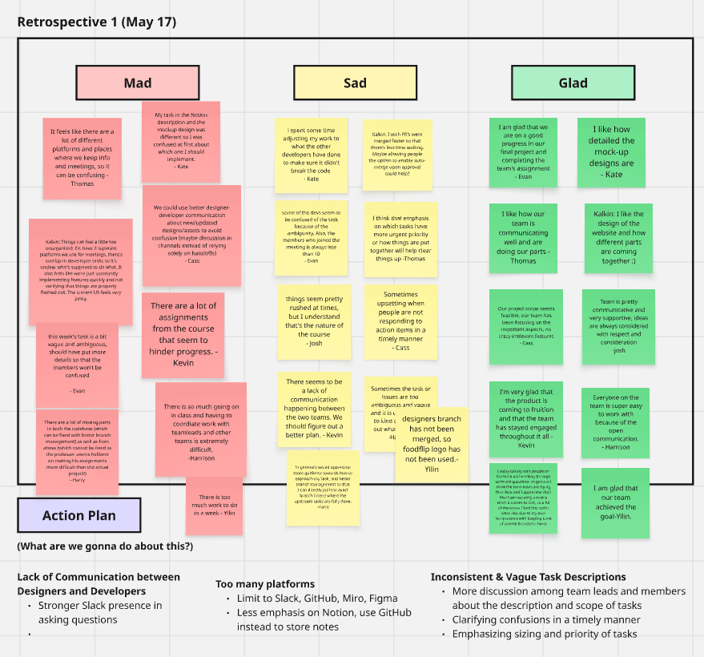

# 🔁 Sprint Review & Retrospective Notes (05-17)

**Date:** 05-17-2025

**Sprint Duration:** 05/12 - 05/18

**Attendees:** evan, nathan, ethan, kate, cass, kalkin, thomas

---

## 📣 Announcements

- Standup with Geekbot today, make sure to fill it out by EOD
- **ASSIGNMENT:**  “Agile - Sprint Review Meetings” (Due 5/18, 5/25, 6/1)
    - Meeting notes stored in **`/admin/meetings/MMDDYY-sprint-X-review.md`**
    - Need input from each member to discuss what they did during the sprint week
    - Will later be used in Team Status Video
- **ASSIGNMENT**: “Agile - Retrospective” (Due 5/18, 5/25, 6/1)
    - Meeting notes stored in [`MMDDYY-retrospective.md`](http://mmddyy-retrospective.md/)
    - Do board on Miro (https://miro.com/app/board/uXjVI0PCs7Q=/)
    - Will later be used in Team Status Video
- **ASSIGNMENT:** "Agile - Team Status Video” due Tuesday May 20 (Done by Team Leads)
    - 4 min or less video showing off status of your software, the function of your pipeline and the health of your team
        - You should also be transparent about any challenges you are facing which may have arising in your retrospective.
        - Finally conclude your video with a preview about what the next sprint will tackle and what stakeholders should look forward to after the next sprint.
    - Stored in `/admin/videos/statusvideo1.mp4`
- We are currently working on a coding style guide

## 🎯 Weekly Sprint Goal Review

> Sprint Goal:
> 
> 
> Designers will create the UI for the card-swiping and collections. Developers will finalize landing page and filters/form interaction logic.
> 

**Was the goal achieved?**

- [ ]  Fully
- [x]  Partially
- [ ]  Not Achieved

**Summary of Completed Tasks:**

- [x]  Swipe Card UI Draft – Owner: Designers
- [x]  Card Detail View Draft – Owner: Designers
- [x]  Placeholder Style Guide & Icons – Owner: Designers
- [ ]  Landing Page and Filters Page Design Finalization and Bug Fixes – Owner: Ethan → almost done
- [ ]  Filter Form Logic + LocalStorageSwipe Page Setup + Basic Styling – Owner: Nathan → almost done
- [x]  Swipe page setup + card layout Harrison
- [ ]  Swipe/Accept/Skip Logic – Owner: Kalkin → almost done
- [ ]  Card Detail View Toggle – Owner: Kate → almost done
- [ ]  Saved Deck Management – Owner: Harry
- [ ]  No More Cards UX + Reset Option – Owner: Josh

---

## 👤 Individual Updates (Team Member Pitches)

- Everyone please fill this out simultaneously, and then we can quickly go over everyone’s responses (You will need a Notion Account)
    - Link to this current notion page: [https://www.notion.so/yuankaiyang/5-17-Sprint-Review-Meeting-Notes-1f6acd29c8b4805a8b5de6a1582bc82a](https://www.notion.so/5-17-Sprint-Review-Meeting-Notes-1f6acd29c8b4805a8b5de6a1582bc82a?pvs=21)

### Cass

- ✅ **What was completed:** Card Selection UI (swipe, help, details), uploaded designs and assets to repo
- ⚠️ **Any blockers faced:** waiting on PR review so developers can use assets
- 💬 **Thoughts/Reflections:**

### Thomas

- **✅ What was completed:** Swipe Card UI, Card Detail Layout, Uploaded assets/icons to repo
- ⚠️ **Any blockers faced:** None really, might be nice to get more team feedback
- 💬 **Thoughts/Reflections:** Might add some cards in the background during swiping to better show the swiping feature

### Yilin

- ✅ **What was completed:**
- ⚠️ **Any blockers faced:**
- 💬 **Thoughts/Reflections:**

### Harrison

- ✅ **What was completed:**
- ⚠️ **Any blockers faced:**
- 💬 **Thoughts/Reflections:**

### Harry

- ✅ **What was completed:**
- ⚠️ **Any blockers faced:**
- 💬 **Thoughts/Reflections:**

### Kate

- ✅ **What was completed:** Implemented the JS function to flip the card and show additional information
- ⚠️ **Any blockers faced:**  Just need image assets to display the top three foods
- 💬 **Thoughts/Reflections:** I needed first to learn what the other developer created and implement my part based on their work. I’m not sure about some of my implementations because it can only be tested once it’s integrated with other features.

### Kalkin

- ✅ **What was completed:** I made progress on my task and hacked together some logic to allow users to swipe through the deck and choose between every restaurant
- ⚠️ **Any blockers faced:** Waiting on Nathan’s filter logic and need to figure out how to render Harrison’s animations when swiping between cards.
- 💬 **Thoughts/Reflections:** I think there was some confusion in knowing who actually does specific parts (like saving accepted cards to local storage — it seems 3 different people had this in their task description!) and there is so much dependency on waiting for other tasks to be completed that it can be hard to even start doing anything without “hacking” together a temporary demo.

### Ethan

- ✅ **What was completed:** I matched text colors and weights to mockup. Updated the card layout include distance and rating.
- ⚠️ **Any blockers faced:** I currently needs the img assets for the card.
- 💬 **Thoughts/Reflections:** Implementing the new changes was straightforward because the existing code/documentation was very clear.

### Nathan

- ✅ **What was completed:** Completed task for flow logic and can go to the next steps when applying filters, filter logic is saved and works
- ⚠️ **Any blockers faced:** Previous task - wasn’t able to properly merge into main due to unused function so may be conflicts, also current collection page is broken now(?)
- 💬 **Thoughts/Reflections:** Should probably work on a reset filter button since it saves the filters perpetually and you may never see some restaurants - need to still fix old task.

### Josh

- ✅ **What was completed:** Started brainstorm on ideas how to use userDeck and show empty screen depending on if the deck is empty
- ⚠️ **Any blockers faced:** The other devs had not pushed their changes yet so I can start building my work on top of theirs
- 💬 **Thoughts/Reflections:** Should try to communicate with the earlier devs to either work earlier or in parallel to finish the task more efficiently

### Evan

- ✅ **What was completed:**

oversee the task for this week
have a meeting with shelby
making an agenda for next meeting (sprint review)
reviewing all PRs tonight
checking the devs task
checking up on team assignment (sprint review and retrospective notes)
discuss about team video with Kevin

- ⚠️ **Any blockers faced:** waiting for all PRs to be pushed
- 💬 **Thoughts/Reflections:**
this week’s task a bit vague and ambiguous, need to be clearer for next week sprint plan so that the members will be able to work on it better

### Kevin

- ✅ **What was completed:**
    - Created templates for team assignments (Sprint Planning, Sprint Review, Retrospective Board, Coding Style guidelines)
    - Met with Shelby
    - Attended designers’ meeting to give feedback and contribute to design
    - Starting first week of standups
- ⚠️ **Any blockers faced:**
    - Big deadlines due on Friday (5/16) and Monday (5/19)
- 💬 **Thoughts/Reflections:**
    - I want to be more involved in what the development team is doing, I feel like I haven’t been engaging with their work as much as I would like to

---
## 🤩 Current Progress

Home Page

Filter Page

---

## ⭐ Time to Fill Out the Miro Board! (Retrospective Section)

- https://miro.com/app/board/uXjVI0PCs7Q=/
- Every attendee should put one sticky note on each column (Mad, Sad, Glad)

---

## 💬 Team Feedback & Discussion Highlights from Miro Board

### ✅ What went well:

- [ ]  Example: Good communication across team
- [ ]  Example: Delivered ahead of schedule

### 🔧 What could have been better:

- [ ]  Example: Earlier testing
- [ ]  Example: More detailed handoff from design to dev

### ⛔ Blockers or Issues:

- [ ]  Lack of Communication between Designers and Developers
    - Stronger Slack presence in asking questions
- [ ]  Too many platforms are used in the team’s workflow
    - Limit to Slack, GitHub, Miro, Figma
    - Less emphasis on Notion, use GitHub instead to store notes
- [ ]  Inconsistent & Vague Task Descriptions
    - More discussion among team leads and members about the description and scope of tasks
    - Clarifying confusions in a timely manner
    - Emphasizing sizing and priority of tasks

---

## 📌 Action Items for Next Sprint

| **Description** | **Owner** | **Due Date** |
| --- | --- | --- |
| Finish all the given task for the final project | Devs | 05-18-2025 |
| Complete each review and retrospective | All members | 05-17-2025 |

---

## 📈 Suggestions / Process Improvements

- [ ]  Add suggestions here for team efficiency, tools, communication, etc.
- give more details for each task and review PR faster
- use one platform for the meeting ( use zoom)
- improve communication between members (open slack more often)

---

## 📋 Summary

- Sprint Outcome: [Achieved/**Partially Achieved**/Not Achieved]
- Major Wins:
    - on a good track in completing final project and this week’s team assignment
- Key Areas to Improve:
    - give more details for each task and review PR faster

---

*End of review and retrospective notes.*