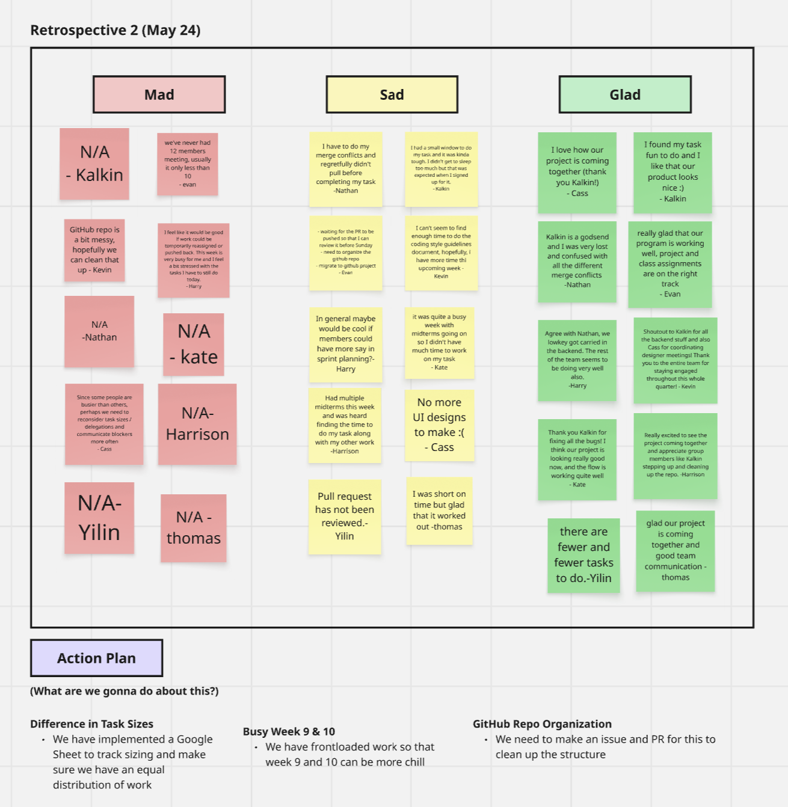

# 🔁 Sprint Review & Retrospective Notes (05-24)

**Date:** 05-24-2025

**Sprint Duration:** 05/19 - 05/25

**Attendees:** Evan, Kevin, Harry, Nathan, Kate, Cass, Yilin, Harrison, Kalkin

---

## Announcements

- Great job team! Applause from Powell
- Standup Today
- Make sure to delete branches
- Github issue (for all completed task that each of you guys have done, please put it in Github issues and close it, it is for documentation and for our TA to see your contribution)
- **ASSIGNMENT:** “Agile - Sprint Review Meetings” (Due 5/25 6/1)
    - Meeting notes stored in **`/admin/meetings/MMDDYY-sprint-X-review.md`**
    - Need input from each member to discuss what they did during the sprint week
- **ASSIGNMENT**: “Agile - Retrospective” (Due 5/25 6/1)
    - Meeting notes stored in [`MMDDYY-retrospective.md`](http://mmddyy-retrospective.md/)
    - Do board on Miro (https://miro.com/app/board/uXjVI0PCs7Q=/)
- **ASSIGNMENT**: “CI/CD Pipeline - Phase 2” (Due 5/25)
    - Store in `/admin/cipipeline`
    - Must include:
        - `phase1.png`: a diagram (can use draw.io)
        - `phase1.md`: ~2-page write-up with embedded diagram
        - `phase1.mp4`: 2-min max video demo of pipeline
    - GitHub Actions required, even if using mock/demo code
- **ASSIGNMENT**: “ADR Documentation” (Due 5/25)
    - Store in `/specs/adrs/`
    - Use format `MMDDYY-Decision-Name.md`
    - Must include at least 4 ADRs
    - Be sure to write as you go (not at the end)

---

## Weekly Sprint Goal Review

> Sprint Goal:
> 
> 
> Complete critical path features across form, collections.html, and swipe.html, ensure all dynamic data integrations are functional, and finalize UI/UX polish with assets applied.
> 

**Was the goal achieved?**

- [ ]  Fully
- [X]  Partially
- [ ]  Not Achieved

**Summary of Completed Tasks:**

### Developers:

- [ ]  Form Flow Logic – **Harry**
- [ ]  Form UI Implementation – **Kate**
- [ ]  Collections Page Full Build – **Josh**
- [ ]  Swipe HTML Visual Fixes + Bug Resolution – **Harrison**
- [ ]  Randomizer & Scroll Fix – **Nathan**
- [x]  System Cleanup: Bugs & Logic – **Kalkin**
- [ ]  Dynamic Restaurant Data w/ Reviews – **Ethan**

### Designers (Thomas, Yilin, Cass):

- [x]  Card Click Design Decision (collections.html)
- [x]  Finalize Collections Card Design
- [x]  Design Finalization Discussion (Alignment & Dev-ready Status)
- [x]  Asset Handoff to Developers

### Total Points

[https://docs.google.com/spreadsheets/d/1KHr-oWJG1LsK_x6JcyCNjkuOzHwOuADGSEI65wSjzXE/edit?gid=0#gid=0](https://docs.google.com/spreadsheets/d/1KHr-oWJG1LsK_x6JcyCNjkuOzHwOuADGSEI65wSjzXE/preview?gid=0#gid=0)

---

## Individual Updates (Team Member Pitches)

- Everyone please fill this out simultaneously, and then we can quickly go over everyone’s responses
    - Link to this current notion page: [https://www.notion.so/Sprint-Review-Retrospective-Notes-05-24-1fd8725a327b8064a1c6d4a427c3c35c](https://www.notion.so/Sprint-Review-Retrospective-Notes-05-24-1fd8725a327b8064a1c6d4a427c3c35c?pvs=21)

### Cass

- **What was completed:** Collection page designs, Github Pages ADR
- **Any blockers faced:** No issues encountered
- **Thoughts/Reflections:** Since designers are done with designing all the pages, I would like to help the developer team and perhaps clean up the UI implementation

### Thomas

- **What was completed:** Collection page design, JSDoc ADR
- **Any blockers faced:** Tight on time, but no issues
- **Thoughts/Reflections:** I can try to contribute to more dev tasks as well

### Yilin

- **What was completed:**
- **Any blockers faced:**
- **Thoughts/Reflections:**

### Harrison

- **What was completed:** Updated `swipe.html` and `style.css` to match the latest UI design, including layout adjustments and asset integration.
- **Any blockers faced:**  Faced layout issues with positioning the instruction text and help icon, which were resolved by restructuring the HTML.
- **Thoughts/Reflections: Learned how small layout changes can impact overall visual hierarchy; feeling more confident with flexbox and CSS tweaks.**

### Harry

- **What was completed: In-progress**
- **Any blockers faced: N/A**
- **Thoughts/Reflections:**

### Kate

- **What was completed:** Implemented the Filter Form Design. Updated the CSS file to match the miro board specifications.
- **Any blockers faced:** There were some differences between the designs given in the miro board and the pages developed, so I had to improvise in some aspects.
- **Thoughts/Reflections:** Maybe the designers could review what has been developed so far and update the design specifications accordingly so that the next stage of development can run smoother.

### Kalkin

- **What was completed:**
    - Merged everything from previous sprint together properly while rewriting some code, doing bug fixes, and improving features to have a functional, flowing card selection page.
- **Any blockers faced:**
    - Merging was kind of hard
    - Not too many blockers
- **Thoughts/Reflections:**
    - I like how things are integrating together nicely. I liked how the planning was done and I didn’t really see any new conflicts this week.

### Ethan

- **What was completed:**
- **Any blockers faced:**
- **Thoughts/Reflections:**

### Nathan

- **What was completed: Added pull request for Dev2 flow form task, completed random generation function.**
- **Any blockers faced: Need to review some of the conflicts between the marge didn’t pull when task was originally written.**
- **Thoughts/Reflections: I need to fix the merge conflict from the previous task and commit the new task.**

### Josh

- **What was completed:**
- **Any blockers faced:**
- **Thoughts/Reflections:**

### Evan

- **What was completed:**
    - created a sprint plan and tasks
    - reviewed and commented to all pull request
    - have a meeting with shelby
    - made meeting agenda for Sprint Review/Retrospective
    - checking up on devs and designers
    - (todo) these revisions based on Shelby’s feedback=
        - organize repo
        - migrate to github project
- **Any blockers faced:** busy week
- **Thoughts/Reflections:** really glad that our program is working well, project and class assignments are on the right track

### Kevin

- **What was completed:**
    - Did the Team Status Video
    - Coordinated teams for ADR and CI/CD
    - Meeting with Shelby
    - Cleaned Up README
    - Approved a few PRs and deleted some branches
- **Any blockers faced:**
    - Extracurriculars and Research Project
- **Thoughts/Reflections:**
    - Thank you to the team for being so reliable and dependable!

---
## 🤩 Current Progress

Home Page

Collections Page

Back of Card

---

## Time to Fill Out the Miro Board! (Retrospective Section)

- https://miro.com/app/board/uXjVI0PCs7Q=/
- Every attendee should put one sticky note on each column (Mad, Sad, Glad)

---

## Team Feedback & Discussion Highlights from Miro Board

### What went well:

- [ ]  the code and program is all fixed now (thanks to Kalkin)
- [ ]  the project is on a good track
- [ ]  the assignments for this week are almost completed

### What could have been better:

- [ ]  use github project
- [ ]  organize github repo
- [ ]  refine github README
- [ ]  more communication in slack
- [ ]  more members to join our meeting
- [ ]  more finished task before Saturday

### Blockers or Issues:

- Difference in Task Sizes
  - We have implemented a Google Sheet to track sizing and make sure we have an equal distribution of work
- Busy Week 9 & 10
  - We have frontloaded work so that week 9 and 10 can be more chill
- GitHub Repo Organization
  - We need to make an issue and PR for this to clean up the structure

---

## Action Items for Next Sprint

| **Description** | **Owner** | **Due Date** |
| --- | --- | --- |
| finish all task before next sprint | all members | 25/05 |
| Create issues and close them |  |  |
|  |  |  |

---

## Suggestions / Process Improvements

- [ ]  more communication in slack
- [ ]  more members to join our meeting
- [ ]  more finished task before Saturday

---

## Summary

- Sprint Outcome: [Achieved/**Partially Achieved**/Not Achieved]
- Major Wins: right track on our final project and class assignments
- Key Areas to Improve: more members to join our meeting, more communication in slack
