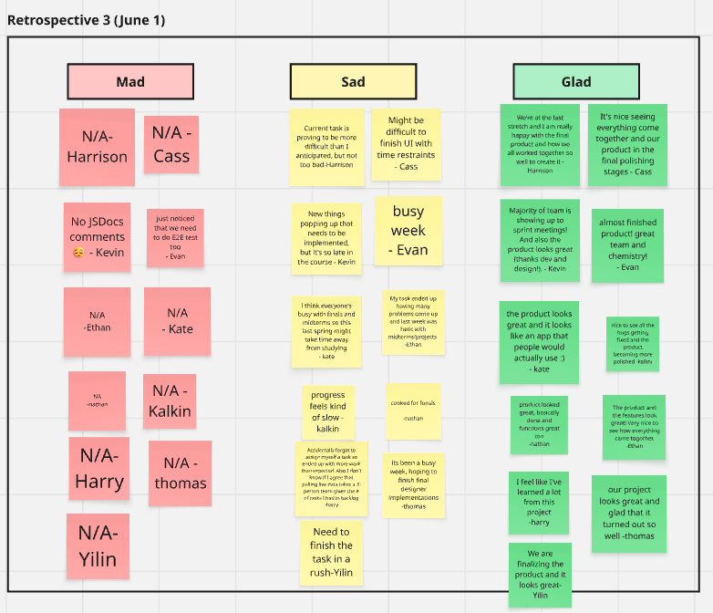

**Date:** 05-31-2025

**Sprint Duration:** 12:00 - 13:00

**Attendees:** Kevin, Harry, Kate, Evan, Kalkin, Yilin, Cass, Harrison, Ethan, Nathan

---

## Announcements & Deadlines

- **CODING FREEZE ON JUNE 8TH**
    - **🔧 Bug Fixes Due TODAY (May 31)** –  **** Please **wrap up** all remaining bug fixes **by tonight.** This is the final push. Don’t delay!
    - Evan will **review all PRs tonight**. Missing the deadline means extra tasks next week.
- **PR Reviews (Optional)
Due: Sunday, June 1 by 11:59 PM**
    - To earn extra points:
        - Pull the latest commit from the PR branch
        - Run **end-to-end tests** and check all **functionality**
        - Ensure **code quality**: naming, styling, no hardcoding, dynamic data only
        - Watch out for **unused PRs** – ask Evan or the author if unsure
        - Leave **respectful, helpful feedback**
- **Weekly Assignment Deadline:**
    
    **Monday, June 2 by 11:59 PM**
    
    - Final project week is for polish and unexpected issues. let us know if you need any extension!
    
    **Only for designers**
    
    - for the task “Code and Implement the changes” the deadline will be longer. If not, we will discuss about it more on our next sprint planning meeting
    (because need to wait for the others to push the changes first)
- **Reminders:**
    - Always write clear PR descriptions
    - Close unused PRs
    - Create GitHub issues for all completed tasks
    - Code Style Guide

---

## Weekly Sprint Goal Review

> Sprint Goal:
> 
> 
> Finalize remaining bug fixes and integrations. Prepare project for end-of-sprint polish and submission.
> 

**Was the goal achieved?**

- [ ]  Fully
- [ ]  Partially
- [ ]  Not Achieved

**Summary of Completed Tasks:**

(To be updated during the meeting)

---

## Individual Updates (Team Member Pitches)

- Everyone please fill this out simultaneously, and then we can quickly go over everyone’s responses
    - Link to this current notion page: [https://www.notion.so/2048725a327b80ecbe41c77847e1c69f?source=copy_link](https://www.notion.so/Sprint-Review-Retrospective-Notes-05-31-2048725a327b80ecbe41c77847e1c69f?pvs=21)

### Cass

- **What was completed: design enhancements and finalizations, started creating issues for new things to implement**
- **Any blockers faced: busy as the quarter comes to a close**
- **Thoughts/Reflections: the product is coming together very nicely**

### Thomas

- **What was completed: design changes and finalization, continuing implementation**
- **Any blockers faced: lots of tasks towards end of quarter**
- **Thoughts/Reflections: app is looking good, hoping to finish up implementations soon**

### Yilin

- **What was completed:**
- **Any blockers faced:**
- **Thoughts/Reflections:**

### Harrison

- **What was completed: I made a new branch to clean up our code and started fixing the HTML to match the style guide. I also looked through the folders to make sure files are in the right place.**
- **Any blockers faced: It’s taking longer than expected because there are a lot of small things to fix in every file. I wasn’t sure where some CSS styles should go, like if something is a component or just a utility.**
- **Thoughts/Reflections:** Following the style guide actually helps the code look way cleaner and easier to work with. It’s kind of satisfying to fix everything and know it’ll help the team later on.

### Harry

- **What was completed:**
    - Filter clearing button
    - Reorganize how cuisine filters are stored + generated to be compatible w API data
    - Quality Monitor Action
- **Any blockers faced:**
    - Friend visited this weekend
- **Thoughts/Reflections:**
    - I had no idea this class was going to take this much work

### Kate

- **What was completed:** I redid last week’s task, updating the UI for the filter flow and added a progress bar feature that updates as you go through each page
- **Any blockers faced:** I had two midterms last week so I kind of started on the task later in the week
- **Thoughts/Reflections:** I think everything is looking good; our MVP is already mostly developed and everyone did a good job with their parts :)

### Kalkin

- **What was completed: Made github issue, did some refactoring**
- **Any blockers faced: Hard to tell which code is unused**
- **Thoughts/Reflections: more work than I expected**

### Ethan

- **What was completed: When adding the dynamic data, there came a bug with swiping. I fixed that bug this week and was making the mobile display reviews as well.**
- **Any blockers faced: Midterm and final project.**
- **Thoughts/Reflections: Should of thought more about approach to implement mobile display mobile.**

### Nathan

- **What was completed: reviewing old PR and seeing what i needed to exit or catchup on, reviewed task and ready to complete scrape for json data**
- **Any blockers faced: power outage, super cooked for finals**
- **Thoughts/Reflections: actually should be able to complete it on time before finals and studying at the same time, probably should have reviewed prs a lot sooner**

### Josh

- **What was completed:**
- **Any blockers faced:**
- **Thoughts/Reflections:**

### Evan

- **What was completed:
-** look and review PRs
- report progress to Shelby
- meeting agenda, sprint plan
- fix a small bug
- **Any blockers faced:**
 - midterm and finals
- **Thoughts/Reflections:**
- great team, great product

### Kevin

- **What was completed:**
    - Reviewed PRs about code style and JSDocs stuff
    - Met with Shelby
    - Uploaded meeting notes and other documents
- **Any blockers faced:**
    - CSE 110
    - Power outage
- **Thoughts/Reflections:**
    - Really proud that everything is coming together

---

## Retrospective – Miro Board

- [Miro Board Link](https://miro.com/app/board/uXjVI0PCs7Q=/)
- Add 1 sticky note in each column – **Mad**, **Sad**, **Glad**

---

## Team Feedback & Discussion

### What went well:

- [ ]  Add during meeting as needed

### Blockers or Issues:

- [ ]  Add during meeting as needed

---

## Action Items for Next Sprint

| **Description** | **Owner** | **Due Date** |
| --- | --- | --- |
| Finish all bug fixes | All members | **Tonight, June 1** |
| Review open PRs (optional) | All members | **June 1, Sunday** |
| Complete weekly assignments | All members | **June 2, Monday** |
| Create issues + close completed tasks | Everyone | NOW (do it in the meeting) |

---

## 🛠️ Suggestions / Process Improvements

- [ ]  Consistent PR quality and cleanup
- [ ]  Increase PR review activity
- [ ]  Better Slack updates and check-ins

---

## Summary

- **Sprint Outcome:**
- **Major Wins:**
- **Key Areas to Improve:**
