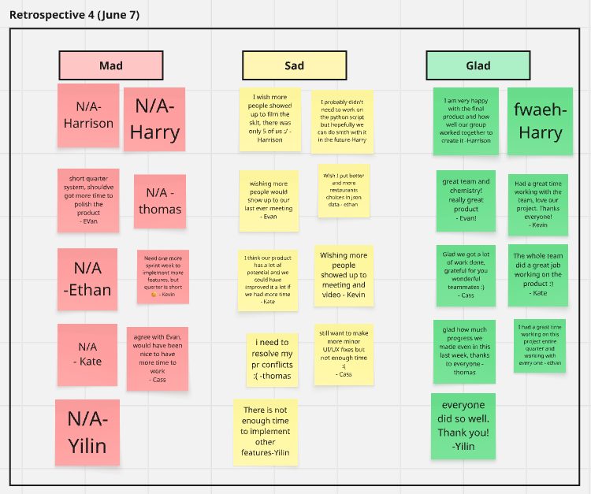

# Sprint Review & Retrospective Notes (06-07)

**Date:** 06-07-2025

**Sprint Duration:** 06/02 - 06/08

**Attendees:** Kevin, Evan, Harry, Harrison, Kate, Cass, Thomas, Ethan, Yilin

---

## Annoucements

- Assignments
    - Public Video (Due June 10)
        - Filmed yesterday, will be put together today
    - Private Video (Due June 10)
        - Will be filmed today or tomorrow
        - Length: **<10 minutes**, informational and unpolished is fine
    - Final Project Submission (Due June 8)
        - Will be submitted after Code Cleanup and Code Style Compliance
- **Close unused PRs, branches, and issues**
- **Discussion for the live data vs current data** 
(show the website https://cse110-sp25-group25.github.io/cse110-sp25-group25 )

## Weekly Sprint Goal Review

> Sprint Goal:
We surprisingly achieved a lot of things this week. All of the optional tasks are taken and a lot of improvements.
> 

**Summary of Completed and Ongoing Tasks:**

[https://www.notion.so/Sprint-Planning-Meeting-Notes-06-02-2078725a327b805fbc64e3ea056641f0](https://www.notion.so/2078725a327b805fbc64e3ea056641f0?pvs=21)

- wrapping up last week’s task
- Added E2E testing using Puppeteer
- Removed filter choice page – now goes straight to cuisine filters for better UX
- Added hyperlink to home on all navbar logos
- Reformatted landing page for mobile view and enabled optional card flipping
- Updated Budget Filter UI – replaced price ranges with labeled buttons ($, $$, $$$)
- Changed Minimum Rating Filter UI for better clarity
- Minor UI/UX fixes:
    - Removed swipe arrows
    - Added homepage instructions
    - Implemented filter progress navigation
- Set up live data fetching using Jupyter Notebook
- Completed PR reviews to ensure code quality and functionality

**Was the goal achieved?**

- [x]  Fully
- [ ]  Partially
- [ ]  Not Achieved

---

## 👤 Individual Updates

- Everyone please fill this out simultaneously, and then we can quickly go over everyone’s responses
    - Link to this current notion page: [https://www.notion.so/yuankaiyang/6-7-Sprint-Review-Meeting-Notes-20bacd29c8b48046b025c5d297c4bed2?source=copy_link](https://www.notion.so/6-7-Sprint-Review-Meeting-Notes-20bacd29c8b48046b025c5d297c4bed2?pvs=21)

### Cass

- **What was completed:** added instructions to homepage and made minor UI/UX fixes (added logo hyperlink, removed swipe arrows, polished swipe buttons, filter progress navigation, favicon and titles)
- **Any blockers faced:** still want to make more changes but busy with finals
- **Thoughts/Reflections:** it was a pleasure working with everyone :)

### Thomas

- **What was completed: finalized mobile landing page layout and implemented card flipping on hover for landing page card**
- **Any blockers faced: just a busy week**
- **Thoughts/Reflections: glad to be done and satisfied with how my task turned out**

### Yilin

- **What was completed: I implemented the minimum rating filter.**
- **Any blockers faced: No**
- **Thoughts/Reflections: Thank you for all your work!**

### Harrison

- **What was completed: I finished the minimum rating filter by adding clickable stars instead of a number input for desktop and mobile. Also, did some codebase refactoring.**
- **Any blockers faced: I had trouble making the stars show up correctly instead of stacking, but ended up fixing it. Also there was a lot of code to go through for the refactoring.**
- **Thoughts/Reflections: I learned a lot about using the CSS flexbox, although the styling was frustrating at first, figuring it out was satisfying.**

### Harry

- **What was completed: Made a small python script to scrape real Restaurant data with Yelp Fusion API**
- **Any blockers faced: Forgot I was supposed to merge my branch**
- **Thoughts/Reflections: hope the video comes out ok 😭**

### Kate

- **What was completed:** I replaced the price input in the Budget filter with price range buttons, so the user now chooses between “$”, “$$”, and “$$$” instead of inputting a fixed amount of dollars into their budget.
- **Any blockers faced:** I had a final on Thursday, but managed to finish my task on time.
- **Thoughts/Reflections:** As we’re approaching the coding freeze deadline, I think our app already looks really good :)

### Kalkin

- **What was completed:** Completed PR for cleaning up the Filter page ui by removing the initial screen, reviewed a lot of PRs and helped with merge conflicts
- **Any blockers faced:** Waiting for PRs to be completed before I can do code cleanup
- **Thoughts/Reflections:** I’m proud of our work! I enjoyed working with everyone.

### Ethan

- **What was completed: I added assets to the swipe cards and added restaurants data to json.**
- **Any blockers faced: Manually collecting images**
- **Thoughts/Reflections: Working on this project has been a great learning experience and very thankful for the group!**

### Nathan

- **What was completed:**
- **Any blockers faced:**
- **Thoughts/Reflections:**

### Josh

- **What was completed:**
- **Any blockers faced:**
- **Thoughts/Reflections:**

### Evan

- **What was completed:**
    - improve product
    - stakeholder testing
    - finished e2e test using puppeteer
    - reviewed all PRs and help the others
    - collaborated for the video assignment
- **Any blockers faced:**
    - finals
- **Thoughts/Reflections:**
    - crazy week, a lot of tasks are completed this week. really great team!!! our product will definitely be top 3

### Kevin

- **What was completed:**
    - Modified the README to have more sections for grading purposes
    - Filmed Public Video, will be filming private video
    - Met with Shelby
    - Discussed with group about live data vs current data
    - Reviewed some PRs and added revisions about code style and JS Docs
    - Puppeteer ADR
- **Any blockers faced:**
    - Midterm week and apporaching deadlines
- **Thoughts/Reflections:**
    - Very thankful for this group!

---

## Retrospective – Miro Board

- [Miro Board Link](https://miro.com/app/board/uXjVI0PCs7Q=/)
- Add 1 sticky note in each column – **Mad**, **Sad**, **Glad**

---

## 💬 Team Feedback & Discussion

### ✅ What went well:

- [ ]  Everyone was very thankful for the group

### 🔧 What could have been better:

- [ ]  Wished we had more time to complete more features

### ⛔ Blockers or Issues:

- [ ]  Finals

---

## 📌 Action Items for Next Sprint

| Description | Owner | Due Date |
| --- | --- | --- |
| code freezes   | All | June 8 |
| check all PR and finish all task now | All | now |
|  |  |  |

---

## 📋 Summary

- Sprint Outcome: Achieved

---

*End of retrospective notes.*