# Quarter Life Crisis

<!-- Team Brand Picture -->
 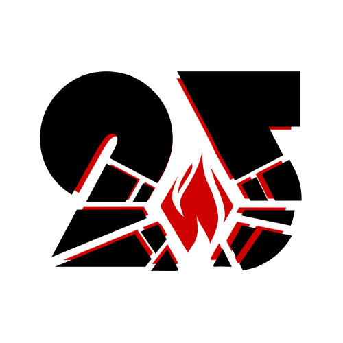

### Our Values
> [!IMPORTANT]
> Key information users need to know to achieve their goal.
- Integrity
- Collaboration
- Gallant
- Responsibility
- Patience
- Respect

### Team Leads

#### Yuan-Kai "Kevin" Yang
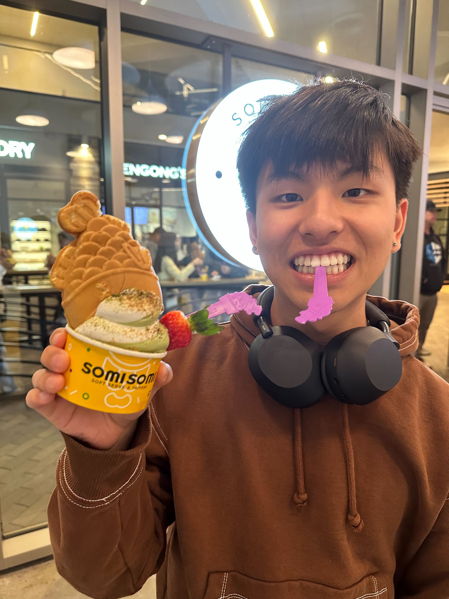

Hello! 👋 I'm Yuan-Kai "Kevin" Yang and I'm a 2nd year Computer Science major in Muir. I'm interested in working with more backend software development and connecting backend to frontend. In my free time I play tennis, go to the movie theaters, and run!  
[Kevin's Github](https://github.com/yuankaiy)

#### Evan Honggo Widjojo
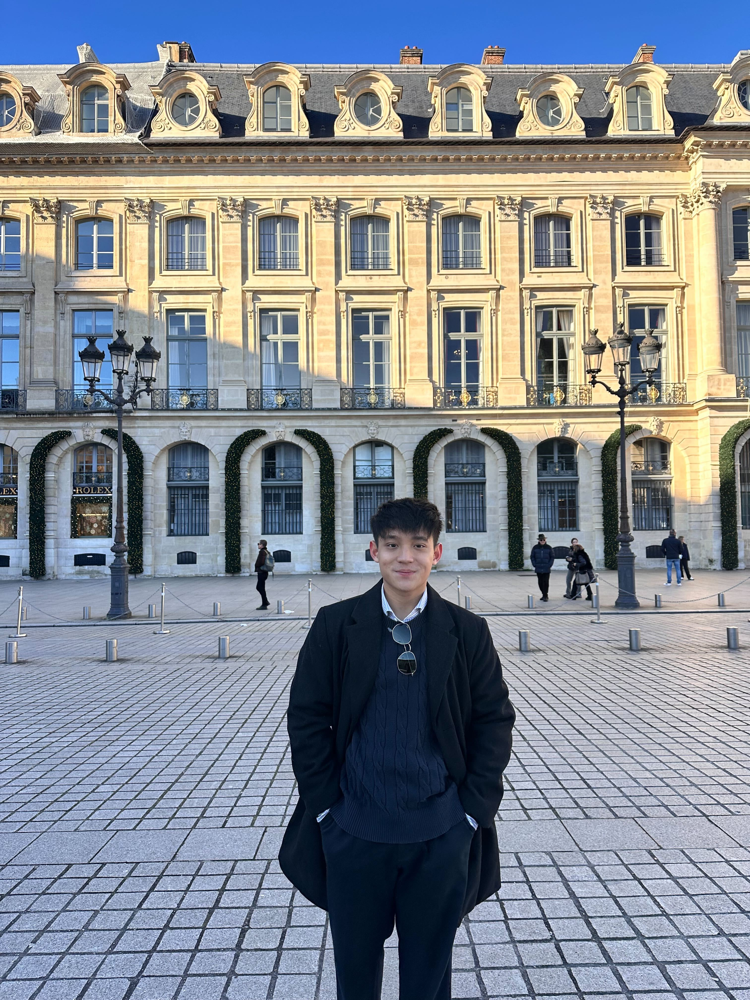

Hi! I’m Evan Honggo Widjojo, a 3rd year CS major in muir. Im an international student from Indonesia and hoping to dive into the startup field in the US. I enjoy brazillian jiujitsu, golf, and boxing.  
[Evan's Github](https://github.com/evanedreo)

### Developers

#### Cass Adefuin
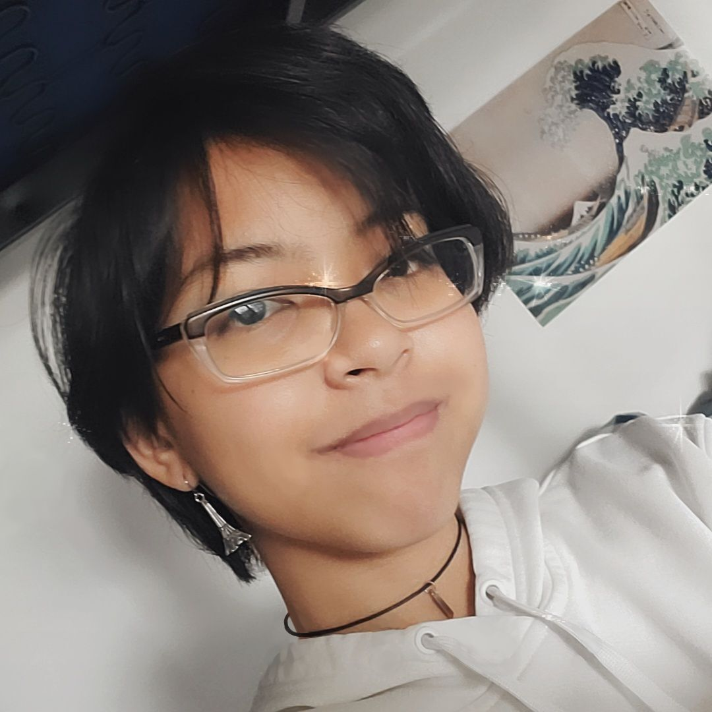

Hello! I'm Cass Adefuin, a 2nd year Computer Science major and Cognitive Science minor. I am interested in front-end software development and UI design. I love trying various art forms and delicious food :)  
[Cass's Github](https://github.com/cadefuin)

<!-- harry picture -->
#### Harry Wang
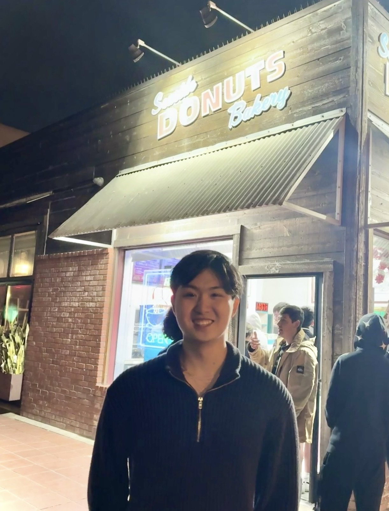

Hi! I'm Harry Wang, a 3rd year student studying Math - Computer Science and Cognitive Science spec. Machine Learning. I am interested in math, machine learning, and AI. In my free time I like playing badminton and cooking food. For breakfast today I had overnight oats!  
[Harry's Github](https://github.com/wangharold001)

<!-- Kalkin picture -->
#### Kalkin
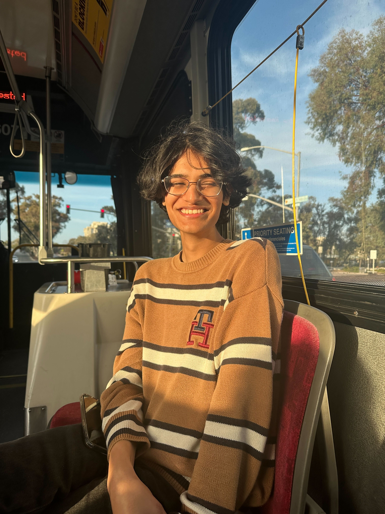

Hi! I'm Kalkin, a 3rd year CE + Math major. I'm generally interested in functional analysis, harmonics, and optimization. I like playing pokemon, reading, hiking, and painting in my free time. My favorite pokemon is Reshiram!  
[Kalkin's Github](https://github.com/kalkulator413)

<!-- Kate picture -->
#### Kate Wang
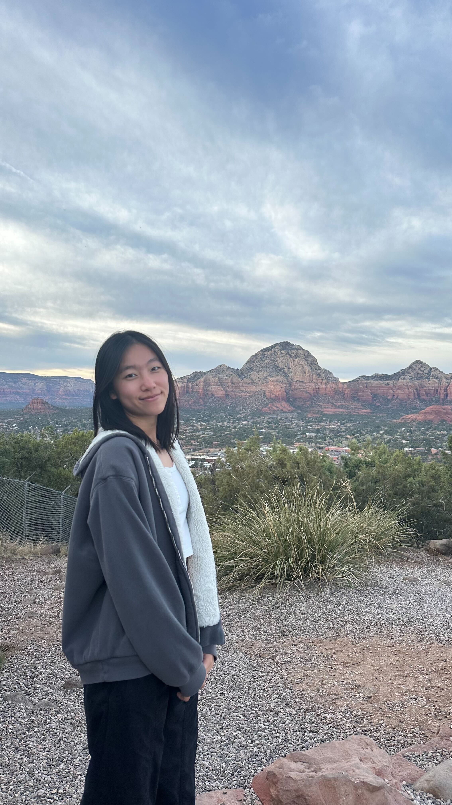

Hi! I'm Kate Wang, a 3rd year Computer Science major from Indonesia. I'm interested in software development, data, and AI. Outside of school, I like playing Ultimate Frisbee, watching movies, and exploring new food spots :)  
[Kate's Github](https://github.com/katew-23)

#### Harrison Le
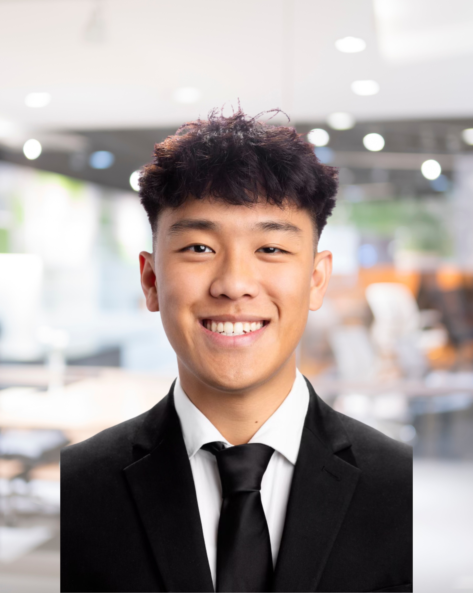

Hi I'm Harrison and I'm a third year computer science major. I like building things and I also like selling. I'm looking to pursue a career in sales/solutions engineering. I love golf and weightlifting, now I'm surfing!  
[Harrison's Github](https://github.com/Harrisonle128)

#### Nathan Chang
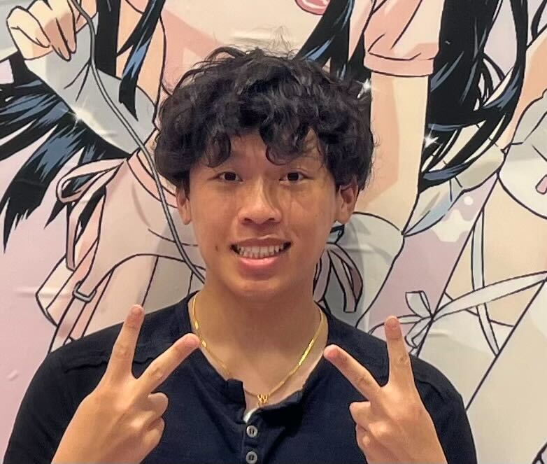

Hi I'm Nathan Chang and I'm a third year math computer science major. I'm a fan building and working on projects with group mates! I'm aspiring to be hopefully a SWE or in some related field, in my free time I enjoy cafe hopping and exploring cities!  
[Nathan's Github](https://github.com/nkcha02)

#### Ethan Luong
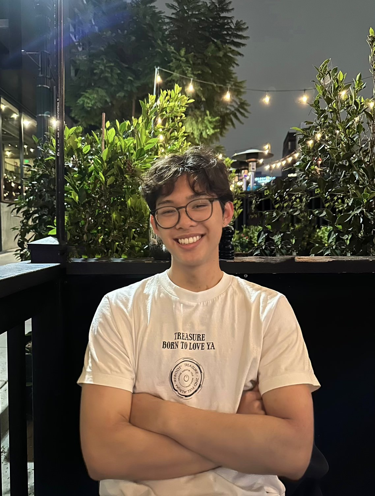

Hello! My name is Ethan and I'm a third year math-computer science major. I am interested in machine learning and back-end development. I love playing poker and basketball in my free time.  
[Ethan's Github](https://github.com/ebluong005)

#### Joshua Park
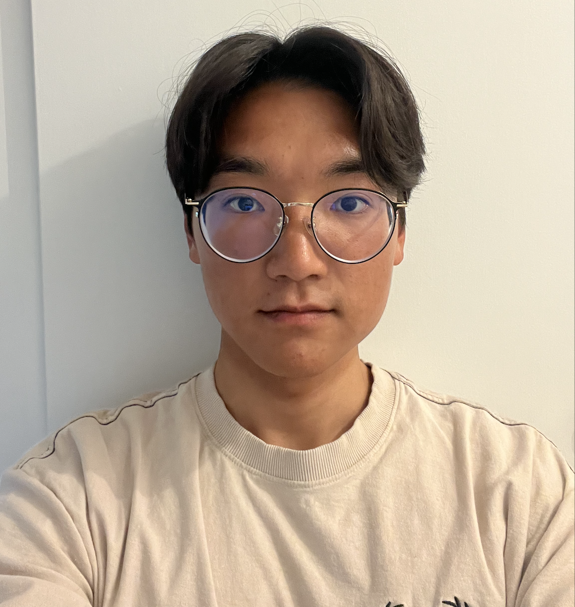

Hi I’m Josh, a 4th year Computer Engineering major. I’m interested in artificial intelligence. I like surfing and snowboarding  
[Josh's Github](https://github.com/joshjppark)

#### Thomas Nghiem
Hi I’m Thomas Nghiem and I’m a second year Computer Engineering major. I’m interested in learning more about robotics and embedded systems. I like to play tennis and volleyball in my free time.  
[Thomas' Github](https://github.com/ThomasNghiem2)

<!--Thomas' Picture -->

#### Yilin Zhang
Hi I am Yilin and I am third year computer science major. I am interested in front end development. My favoriate sport is swimming.

